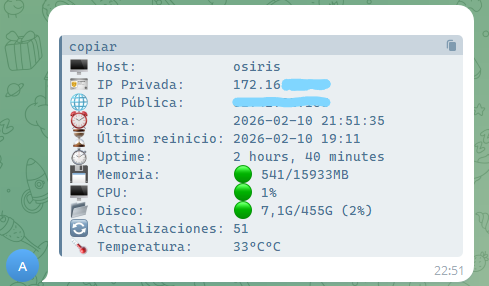

>
⚠️ <i><small>Disclaimer Este script se entrega "tal cual". Si al ejecutarlo tu servidor cobra conciencia propia, decide que el punto de montaje / es su nuevo hogar espiritual o empieza a minar Dogecoin para comprarse una GPU mejor, yo solo pasaba por aquí. Úsalo bajo tu propio riesgo y disfruta de los emojis.😅</small></i>

### 🖥️ SentinelBot: El chivato de Telegram para tu servidor
Bitácora del Sysadmin: "Hubo un corte de luz a las 3 AM. El servidor ha vuelto a la vida, pero mi ISP ha decidido cambiarme la IP pública y no tengo ganas de conectar un monitor en el sótano para saber dónde demonios está mi SSH."

SentinelBot es un script de Bash minimalista diseñado para ejecutarse en el arranque (@reboot). Su misión es simple: sobrevivir al caos y enviarte un reporte detallado a Telegram sobre la salud de tu máquina antes de que tú siquiera te hayas terminado el primer café.

#### ✨ ¿Qué hace este bicho?
A diferencia de montar un Grafana pesado que consume más RAM que tu base de datos, **SentinelBot** es un ninja:

1. **🪪 Localización**: Te da tu IP Privada y Pública (adiós a jugar a las adivinanzas con el DHCP).
2. **🚦 Semáforos Inteligentes**: Visualiza el estado de CPU, RAM y Disco con códigos de colores (🟢, 🟡, 🔴).
3. **🌡️ Termómetro**: Te avisa si tu procesador está más caliente que una pizza recién sacada del horno.
4. **🔄 Updates**: Te dice cuántos paquetes están esperando a que rompas el sistema con un apt upgrade.

#### 📸 Así se ve en tu móvil
Cuando tu servidor arranca (o cuando tú decidas), recibirás algo tan elegante como esto:

#### 🚀 Instalación (Para humanos con prisa)
1. Crea tu Bot: Habla con @BotFather en Telegram, crea un bot y guarda el TOKEN.

    Obtén tu ID: Habla con @userinfobot para saber tu CHAT_ID.

2. Clona y Configura:

        git clone https://github.com/iMonje/sentinel-bot.git
        cd sentinel-bot
        chmod +x sentinel.sh
3. Crea el archivo de secretos: Crea un archivo llamado .env (y asegúrate de que esté en tu .gitignore):
    
        TOKEN="tu_token_aqui"
        CHAT_ID="tu_id_aqui"
4. Pruébalo: Ejecuta el script manualmente para asegurarte de que todo funciona:

        sudo ./sentinel.sh
5. Hazlo automático: Añade esta línea a tu crontab -e para que el servidor te salude al arrancar:

        @reboot /ruta/a/tu/script/sentinel.sh

#### 🛠️ Filosofía
Este proyecto nació porque hdd-physical-mapper necesitaba un compañero que informara del estado general. Es ideal para Raspberry Pi, VPS modestos o ese portátil viejo que tienes haciendo de servidor de Plex bajo la cama.

¿Te ha servido? Dame una ⭐ en GitHub a mi servidor le gustará 😎